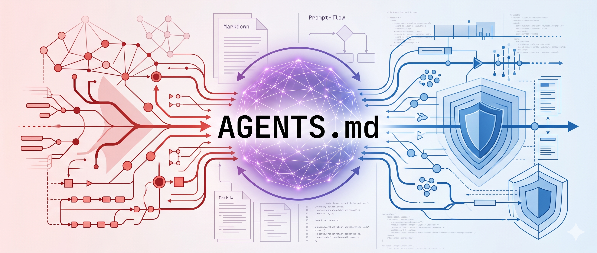

# AGENTS.md - Agent Instruction Profiles

<p align="center">
  
</p>

<p align="center">
  <strong>Antigravity CLI | Gemini CLI | Codex CLI instruction profiles focused on defensive and offensive workflows.</strong>
</p>

<p align="center">
  <a href="https://github.com/crtvrffnrt/AGENTS.md"></a>
  <a href="https://github.com/crtvrffnrt/skills"></a>
  <a href="https://www.patrick-binder.de/"></a>
</p>

This repository is a collection of `AGENTS.md` instruction profiles for different operating modes. Use the core profiles globally, then drop a focused sub-profile into a project folder when the task needs a narrower behavior.

Created and maintained by [Patrick Binder](https://www.patrick-binder.de/). For background, security notes, and consulting context, visit [patrick-binder.de](https://www.patrick-binder.de/).

## Intro

The files in this repository are meant to make AI assistants predictable in technical work:

- **Core profiles** define the long-running baseline for broad work modes such as blue team, red team, development, or general assistant behavior.
- **Sub profiles** define focused project-level behavior for bug bounty, HTB/lab work, reconnaissance, exploitation, Playwright automation, web work, KQL, and similar use cases.
- **Prompts and directives** provide reusable language, reporting, and terminology rules that can be pasted into custom instruction fields.

The recommended pattern is:

1. Install one global core profile for the assistant runtime.
2. Add one project-local `AGENTS.md` or `GEMINI.md` for the current repository or assessment folder.
3. Install the matching skills from [`crtvrffnrt/skills`](https://github.com/crtvrffnrt/skills) when the profile depends on skill routing.

## Profile Map

| Profile | Purpose | Typical scope |
| --- | --- | --- |
| `AGENTS-CORE-BLUE.md` | Defensive investigation, SOC triage, incident response, evidence-based reporting | Global |
| `AGENTS-CORE-RED.md` | Authorized red team, penetration testing, vulnerability research, exploit validation | Global |
| `AGENTS-CORE-DEV.md` | Development-focused engineering assistant behavior | Global or project |
| `AGENTS-CORE.md` | General baseline behavior | Global |
| `AGENTS-SUB-BUG.md` | Bug bounty and application security project work | Project |
| `AGENTS-SUB-HTB.md` | Hack The Box and lab machine workflow | Project |
| `AGENTS-SUB-RECON.md` | Reconnaissance and surface mapping | Project |
| `AGENTS-SUB-EXPLOIT.md` | Controlled exploit validation workflow | Project |
| `AGENTS-SUB-PLAYWRIGHT.md` | Browser automation and Playwright workflows | Project |
| `AGENTS-WEB.md` | Web application work | Project |
| `AGENTS-KQL.md` | KQL and Microsoft security query work | Project |
| `AGENTS-API.md` | API-focused work | Project |
| `AGENTS-entra.md` | Microsoft Entra-focused work | Project |
| `AGENTS-SUB-MAIL-ANALYSIS.md` | Mail artifact, phishing, spam, and BEC triage | Project |
| `AGENTS-SUB-BLOODHOUND-API.md` | BloodHound Enterprise API work | Project |
| `AGENTS-SUB-BLUE.md` | Lightweight defensive sub-agent overlay | Project |
| `AGENTS-Aisupercycle.md` | Market and technology intelligence workflow | Project |

## Instruction Hierarchy

Use the runtime's system and developer instructions first, then the global core profile, then any project-local profile, then the selected skill. User scope and explicit constraints remain authoritative for the current task.

Profiles choose one owner skill per phase. Add a supporting skill, cross-check, or reviewer only when it materially improves evidence quality, validates a high-impact claim, resolves ambiguity, or handles a phase transition.

## How To Use

The core profiles are best installed globally. Sub profiles are best installed per project so each working directory can carry its own task-specific behavior.

### Global Core Profile

Use a global profile when you want every new assistant session to start from the same baseline.

```bash
mkdir -p "$HOME/.gemini" "$HOME/.codex"

wget -O "$HOME/.gemini/GEMINI.md" \
  https://raw.githubusercontent.com/crtvrffnrt/AGENTS.md/main/AGENTS-CORE-BLUE.md

cp "$HOME/.gemini/GEMINI.md" "$HOME/.codex/AGENTS.md"
```

For a red team baseline, switch the source file:

```bash
mkdir -p "$HOME/.gemini" "$HOME/.codex"

wget -O "$HOME/.gemini/GEMINI.md" \
  https://raw.githubusercontent.com/crtvrffnrt/AGENTS.md/main/AGENTS-CORE-RED.md

cp "$HOME/.gemini/GEMINI.md" "$HOME/.codex/AGENTS.md"
```

### Project Profile

Use a project-local profile when a single repository or assessment folder needs a focused role.

```bash
wget -qO- \
  https://raw.githubusercontent.com/crtvrffnrt/AGENTS.md/main/AGENTS-SUB-BUG.md \
  | tee GEMINI.md AGENTS.md > /dev/null
```

That writes the same profile to both `GEMINI.md` and `AGENTS.md`, which keeps Gemini and Codex aligned inside the current folder.

## Example Aliases

These examples keep the same pattern as the commands above: core profiles are global, sub profiles are per project. Add only the aliases you actually use to your shell config.

```bash
alias initcoreblue='mkdir -p "$HOME/.gemini" "$HOME/.codex" && wget -O "$HOME/.gemini/GEMINI.md" https://raw.githubusercontent.com/crtvrffnrt/AGENTS.md/main/AGENTS-CORE-BLUE.md && cp "$HOME/.gemini/GEMINI.md" "$HOME/.codex/AGENTS.md"'
alias initcorered='mkdir -p "$HOME/.gemini" "$HOME/.codex" && wget -O "$HOME/.gemini/GEMINI.md" https://raw.githubusercontent.com/crtvrffnrt/AGENTS.md/main/AGENTS-CORE-RED.md && cp "$HOME/.gemini/GEMINI.md" "$HOME/.codex/AGENTS.md"'

alias initbug='wget -qO- https://raw.githubusercontent.com/crtvrffnrt/AGENTS.md/main/AGENTS-SUB-BUG.md | tee GEMINI.md AGENTS.md > /dev/null'
alias inithtb='wget -qO- https://raw.githubusercontent.com/crtvrffnrt/AGENTS.md/main/AGENTS-SUB-HTB.md | tee GEMINI.md AGENTS.md > /dev/null'
alias initrecon='wget -qO- https://raw.githubusercontent.com/crtvrffnrt/AGENTS.md/main/AGENTS-SUB-RECON.md | tee GEMINI.md AGENTS.md > /dev/null'
```

## Skill Dependencies

Some profiles are designed to work with the companion skills repository:

[https://github.com/crtvrffnrt/skills](https://github.com/crtvrffnrt/skills)

Install the skills with:

```bash
npx skills add crtvrffnrt/skills
```

### CORE-BLUE Skills

Install the skills before using `AGENTS-CORE-BLUE.md` for incident response work:

- `incident-response-main`
- `incident-response-bec`
- `incident-response-report`

### CORE-RED Skills

Install the skills before using `AGENTS-CORE-RED.md` for authorized red team, application security, or vulnerability validation work:

- `pentest-recon-surface-analysis`
- `pentest-web-application-logic-mapper`
- `pentest-authentication-authorization-review`
- `pentest-advanced-access-control-auditor`
- `pentest-xss`
- `pentest-input-protocol-manipulation`
- `pentest-business-logic-abuse`
- `pentest-cve-vulnerability-research-helper`
- `pentest-outbound-interaction-oob-detection`
- `pentest-exploit-execution-payload-control`
- `pentest-evidence-structuring-report-synthesis`
- `pentest-hacktricks-finder`

The local CORE-RED profile and skill docs reference these tools or tool families:

- Web and surface mapping: `katana`, `httpx`, `curl`, `ffuf`, `feroxbuster`, historical URL sources, and `seclists`
- DNS and enrichment: `dnsx`, Shodan DNS API, `jq`
- Template-based validation: `nuclei`
- OOB validation: `interactsh-client`
- CVE research: `vulnx` with `PDCP_API_KEY` when available

Some ProjectDiscovery tools are commonly installed through `pdtm`, Go, or distro-specific packages. Install only the tools needed for the active phase and keep operational installation explicit.
